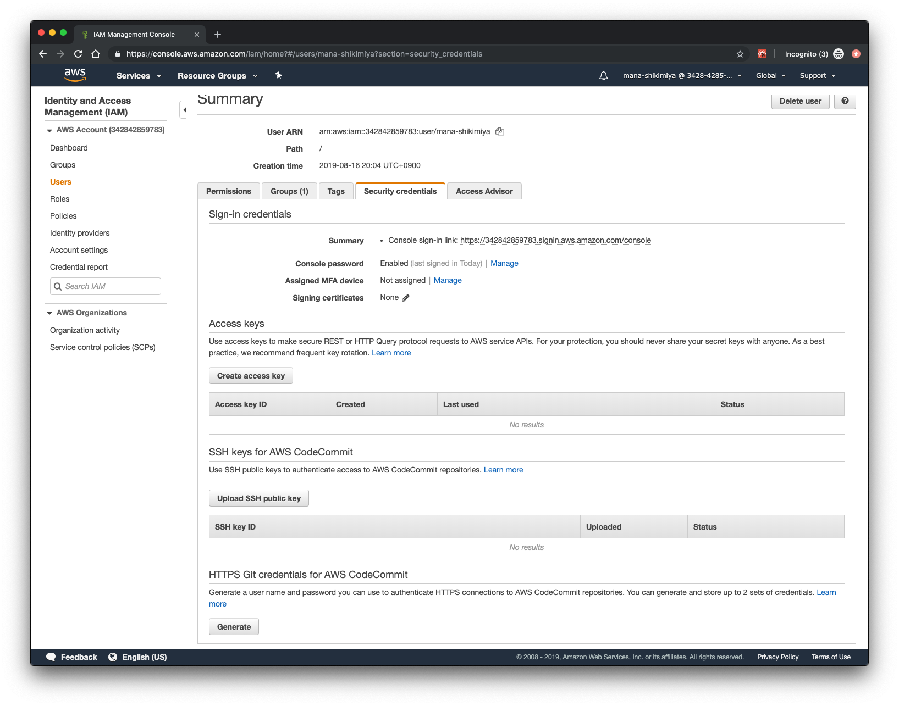
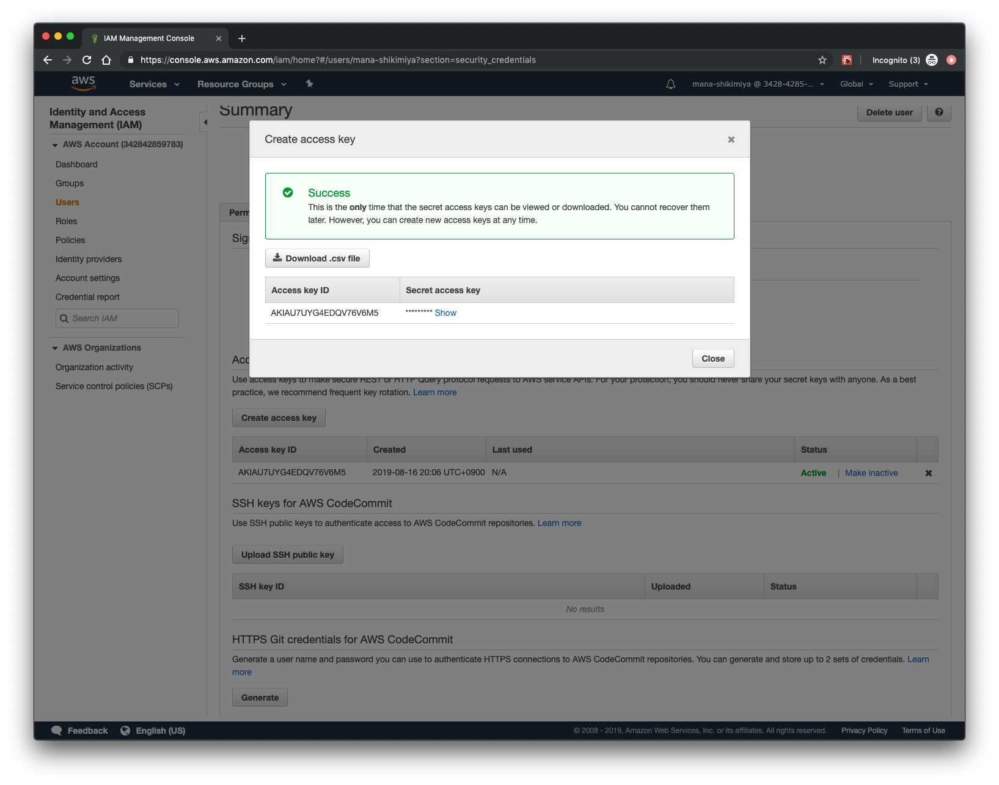
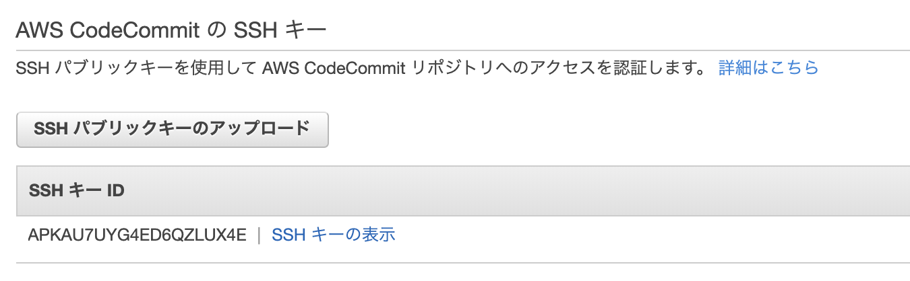

# AWS

## マネジメントコンソールへのアクセス
https://342842859783.signin.aws.amazon.com/console/ にアクセスし、ログインしてください。

## 認証情報の設定
(以下 IAM ユーザ名を tsukuba-komuro として進めていくので適宜読み替えてください)

<https://console.aws.amazon.com/iam/home?#/users/tsukuba-komuro?section=security_credentials> にアクセスします。ここで AWS の API を叩くための認証情報を発行します。



Create access key を押下し、Access Key ID と Secret access key を手元にメモします。Secret access key は秘密にすべき値です。



続いて AWS SDK の設定をします。

[00. 事前準備](00-setup) で用意した tsukuba-playground のディレクトリに移動し、 tsukuba-playground 内のシェルで `aws configure` を設定します。

```console
$ docker-compose run shell
root@1f2316472d5c:~# aws configure
AWS Access Key ID: AKIAxxxxxxxxxxxxxxxxxxxx
AWS Secret Access Key:  xxxxxxxxxxxxxxxxxxxxxxxx
Default region name: ap-northeast-1
Default output format: json
```

### envchain
今回は `aws configure` コマンドを用いて `~/.aws/credentials` にアクセスキーを保存していますが、平文のテキストで保存されてしまいますしセキュリティ上あまりよろしくないため、あまり推奨しません。
クックパッド社内では [envchain](https://github.com/sorah/envchain) というツールを利用してそれらの値を設定しています。

## アクセスキー経由のアクセス
tsukuba-playground 内のシェルでアクセスキー経由で AWS にアクセスしてみましょう。

```console
root@7e46d67b61a8:~# aws codecommit get-repository --repository-name tsukuba-ecs-internship-infra
```

認証情報を適切に設定できていればリポジトリの情報が表示されるはずです。


## インフラコードのクローン
先程 aws コマンド経由で表示した tsukuba-ecs-internship-infra のリポジトリをクローンしてみましょう。

このリポジトリは AWS の CodeCommit というフルマネージドソースコード管理サービスにホストしています。

### CodeCommit のセットアップ
<https://console.aws.amazon.com/iam/home?region=ap-northeast-1#/users/tsukuba-komuro?section=security_credentials>

“Upload SSH public key” を押下し、自分の公開鍵 ($HOME/.ssh/id_rsa.pub) をコピーして貼り付けて進みます。



追加された鍵の SSH Key ID を手元にメモします。続いて <https://docs.aws.amazon.com/ja_jp/codecommit/latest/userguide/setting-up-without-cli.html> のドキュメントの手順に沿って SSH 接続設定を進め、 CodeCommit との SSH 接続を設定してください。

以下のようなコマンドを実行し、正しく設定できていることを確認してください。

```console
$ ssh git-codecommit.ap-northeast-1.amazonaws.com
You have successfully authenticated over SSH. You can use Git to interact with AWS CodeCommit. Interactive shells are not supported.Connection to git-codecommit.ap-northeast-1.amazonaws.com closed by remote host.
Connection to git-codecommit.ap-northeast-1.amazonaws.com closed.
```

### CodeCommit からのクローン
<https://ap-northeast-1.console.aws.amazon.com/codesuite/codecommit/repositories/tsukuba-ecs-internship-infra/browse?region=ap-northeast-1> にアクセスし、「SSH のクローン」からコードをクローンしてきてください。

クローンしてくる場所は tsukuba-playground リポジトリの home/ ディレクトリ以下にしてください。 tsukuba-playground/home/ 以下は tsukuba-playground の Docker コンテナ内部とも共有しています。 tsukuba-playground のシェル内でも tsukuba-ecs-internship-infra が存在することを確認してください。

```console
root@7e46d67b61a8:~# cd tsukuba-ecs-internship-infra/
root@7e46d67b61a8:~/tsukuba-ecs-internship-infra# ls
README.md  hako  terraform
```

## 参考リンク
- https://docs.aws.amazon.com/ja_jp/codecommit/latest/userguide/setting-up-gc.html
