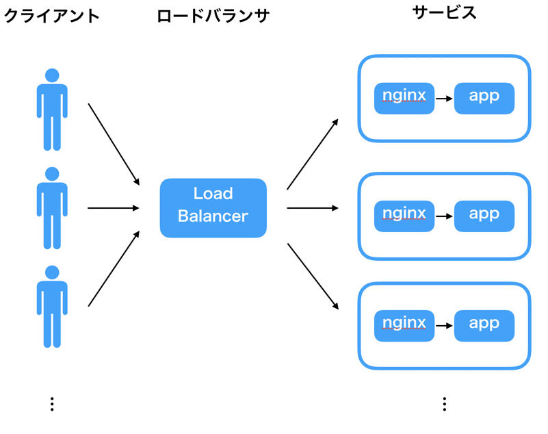

# Hako
ここまででためしたように全て手動で実行すると ECS は先程のようにしてアプリケーションをデプロイ・実行することができます。

ECS を使ったデプロイをある程度定型化し、コマンドから簡単にデプロイできるようにした Hako <https://github.com/eagletmt/hako> というツールを用いてデプロイしてみます。

## 基本構成
Hako を利用するときの ECS でのウェブアプリケーションの基本構成は以下のようになります。



- ECS タスクの前にロードバランサを配置し
- 各 ECS タスク内には http 通信を一次請けする nginx コンテナとアプリケーションのコアなロジックを持つ app コンテナが動く

Hako ではこのロードバランサ、ECS サービスなどをひとまとめにして「Hako アプリケーション」という単位でデプロイ・管理します。


## hako deploy
tsukuba-playground のシェル内で `~/tsukuba-ecs-internship-infra/hako` ディレクトリに移動し、以下のコマンドを実行してください。

```console
$ bundle install
```

`tsukuba-ecs-internship-infra/hako/apps` 以下にはテンプレートとなる Hako アプリケーションの定義ファイルが置いてあります。

- `your-app.jsonnet`: 「Hako アプリケーション」の定義ファイル
- `lib/common.libsonnet`: 各 Hako アプリケーションで共通となる設定ファイル

上記2ファイル内にある `// EDIT HERE` と書いてある行を修正して、自分で作成した Docker イメージ、ECS クラスタを利用する Hako アプリケーション定義を作成してみましょう。

- `your-app.jsonnet`
  - ファイル名を `sample-app-komuro.jsonnet` のように、作成した Docker イメージ名に変更します
  - `local appId = 'your-app';  // EDIT HERE`, `image: '342842859783.dkr.ecr.ap-northeast-1.amazonaws.com/your-app', // EDIT HERE` your-app の部分を作成した Docker イメージ名に修正します
- `lib/common.libsonnet`: 各 Hako アプリケーションで共通となる設定ファイル
  - `cluster: 'your-cluster', // EDIT HERE` 作成したクラスタ名に修正

設定が済んだら以下のデプロイコマンドを実行してみましょう。

```console
$ bundle exec hako deploy apps/sample-app-komuro.jsonnet
```

適切に設定できていれば、ALB の作成、ECS タスクの定義、ECS クラスタへの ECS サービスの登録が実行され、アプリケーションがインターネットからアクセス可能な状態になっているはずです。

### hako-nginx
Hako アプリケーションが利用する nginx コンテナは定型的な「80 ポートに来た HTTP アクセスを適切なポートにリダイレクトする」というシンプルな仕事しかしていないため、同じイメージを使いまわしています。

ここでは以下のリポジトリにある hako-nginx を利用しています。

<https://github.com/hogelog/hako-nginx>

Dockerfile, run-nginx.rb を見てもらえればわかりますが、S3 から設定ファイルをダウンロードしてきて nginx を起動するだけのシンプルなイメージです。

## 発展
時間があったら好きなことをしてみましょう。

- 好きなアプリケーションを Docker 化して Hako アプリケーションとしてデプロイしてみる
- Fargate ではない ECS クラスタを作成してみる
- ECS を完全理解する
- ご家庭 AWS に ECS/Hako 環境を構築してみる

## 参考リンク
- <https://github.com/eagletmt/hako>
- <https://jsonnet.org/>
